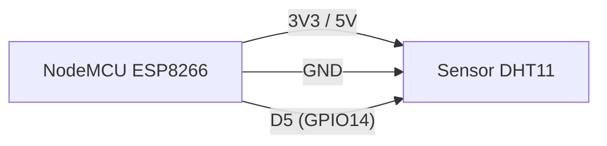
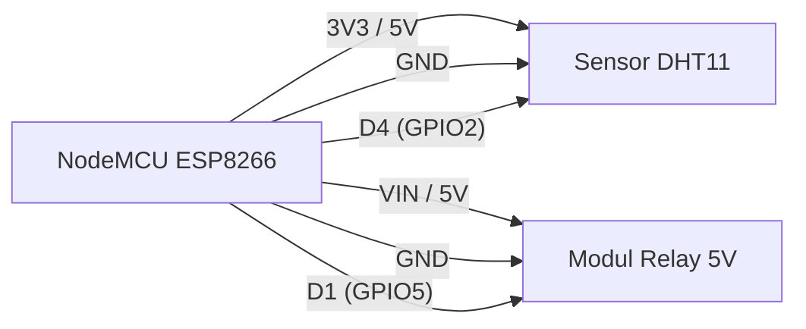
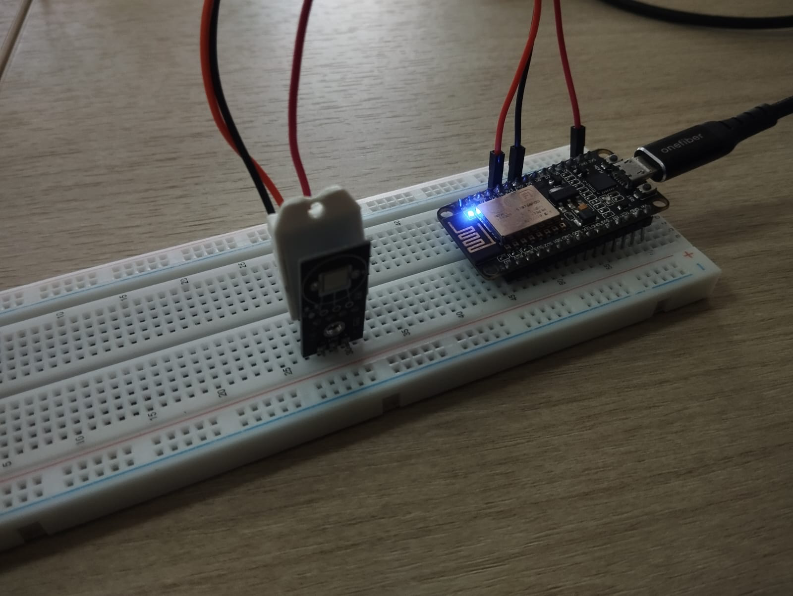
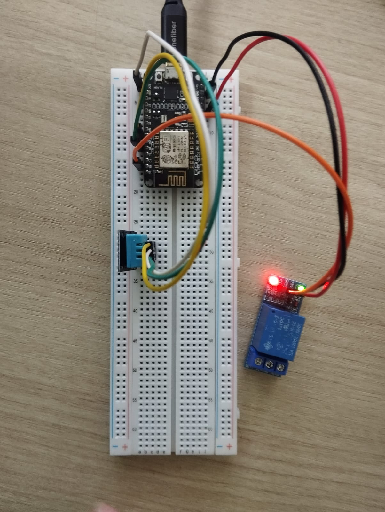

# Praktikum IoT - Modul 1: Sensor dan Aktuator

Dokumentasi praktikum Modul 1 IoT: pembacaan sensor DHT11 (suhu dan kelembaban) serta pengendalian aktuator relay berbasis ESP8266 (NodeMCU).

---

## 1. Percobaan 1: Pembacaan Sensor DHT11

### A. Penjelasan Singkat Percobaan
Membaca suhu dan kelembaban dari sensor DHT11 lalu menampilkannya ke Serial Monitor tiap 1 detik.

### B. Library & Dependencies
*   **DHT11 library by Dhruba Saha** (`DHT11.h`)

### C. Penjelasan Kode & Fungsi (`percobaan1.cpp`)

```cpp
#include <DHT11.h>

DHT11 dht11(D5); // Inisialisasi pin data DHT11 pada pin D5 (GPIO14)

void setup() {
    Serial.begin(9600); // Set baud rate komunikasi serial ke 9600 bps
}

void loop() {
    int temperature = 0;
    int humidity = 0;
    int result = dht11.readTemperatureHumidity(temperature, humidity); // Baca sensor

    if (result == 0) { // Cek status baca
        Serial.print("Temperature: ");
        Serial.print(temperature);
        Serial.print(" °C\tHumidity: ");
        Serial.print(humidity);
        Serial.println(" %");
    } else {
        Serial.println(DHT11::getErrorString(result)); // Cetak pesan gagal
    }

    delay(1000); // Jeda sampling 1 detik
}
```

*   `DHT11 dht11(D5)`: Objek sensor terhubung ke pin D5 (GPIO14).
*   `Serial.begin(9600)`: Mengaktifkan komunikasi serial 9600 baud.
*   `dht11.readTemperatureHumidity(temperature, humidity)`: Mengambil suhu dan kelembaban sekaligus, mengembalikan kode status (`0` berarti sukses).
*   `DHT11::getErrorString(result)`: Mengubah kode error jadi pesan teks yang jelas.
*   `delay(1000)`: Jeda 1000 ms antar pembacaan.

### D. Penjelasan Percabangan / Conditional
*   `if (result == 0)`: Jika pembacaan sukses, cetak suhu dan kelembaban.
*   `else`: Jika gagal, cetak pesan error sesuai kode kegagalan.

---

## 2. Percobaan 2: Kontrol Aktuator Relay Berdasarkan Suhu

### A. Penjelasan Singkat Percobaan
Membaca suhu dan kelembaban dari DHT11 lalu menyalakan atau mematikan relay otomatis berdasarkan ambang batas suhu 29.0 °C.

### B. Library & Dependencies
*   **DHT sensor library by Adafruit** (`DHT.h`)
*   **Adafruit Unified Sensor** (dependency pendukung library Adafruit DHT)

### C. Penjelasan Kode & Fungsi (`percobaan2.cpp`)

```cpp
#include <DHT.h>

#define DHTPIN D4         // Pin data sensor DHT11 di D4 (GPIO2)
#define DHTTYPE DHT11     // Tipe sensor: DHT11
#define RELAYPIN D1       // Pin kontrol relay di D1 (GPIO5)

DHT dht(DHTPIN, DHTTYPE);

const float suhuThreshold = 29.0; // Batas suhu pemicu relay (°C)

void setup() {
  Serial.begin(9600);
  dht.begin();
  
  pinMode(RELAYPIN, OUTPUT);
  digitalWrite(RELAYPIN, HIGH); // Kondisi awal: relay mati (Active LOW)
}

void loop() {
  delay(1000);

  float humidity = dht.readHumidity();
  float temperature = dht.readTemperature();

  if (isnan(humidity) || isnan(temperature)) { // Validasi bacaan sensor
    Serial.println("Gagal membaca dari sensor DHT11!");
    return;
  }

  Serial.print("Temperature: ");
  Serial.print(temperature, 1);
  Serial.print(" °C\tHumidity: ");
  Serial.print(humidity, 1);
  Serial.print(" % -> ");

  if (temperature > suhuThreshold) { // Evaluasi batas suhu
    digitalWrite(RELAYPIN, LOW);   // Relay ON
    Serial.println("Aktuator: ON");
  } else {
    digitalWrite(RELAYPIN, HIGH);  // Relay OFF
    Serial.println("Aktuator: OFF");
  }
}
```

*   `#define DHTPIN D4`: Alias pin sensor ke D4 (GPIO2).
*   `#define RELAYPIN D1`: Alias pin relay ke D1 (GPIO5).
*   `DHT dht(DHTPIN, DHTTYPE)`: Objek sensor dengan konfigurasi pin dan tipe.
*   `dht.begin()`: Inisialisasi komunikasi sensor DHT.
*   `pinMode(RELAYPIN, OUTPUT)`: Set pin relay sebagai output.
*   `dht.readHumidity()` & `dht.readTemperature()`: Ambil nilai kelembaban dan suhu bertipe float.
*   `isnan(...)`: Cek apakah hasil bacaan tidak valid (*Not a Number*).
*   `digitalWrite(RELAYPIN, LOW/HIGH)`: Atur level tegangan pin relay.

### D. Penjelasan Percabangan / Conditional
1.  `if (isnan(humidity) || isnan(temperature))`: Deteksi kegagalan sensor. Jika NaN, cetak error dan `return` untuk hentikan iterasi saat itu.
2.  `if (temperature > suhuThreshold)`: Jika suhu di atas 29.0 °C, relay ON (`LOW`, karena Active LOW). Jika tidak, relay OFF (`HIGH`).

---

## 3. Jawaban Pertanyaan Praktikum (6.4)

### 1. Mengapa diperlukan nilai ambang batas (threshold) dalam sistem kendali aktuator berbasis sensor?
Agar mikrokontroler punya patokan jelas kapan aktuator harus berubah status, dari ON ke OFF atau sebaliknya.

### 2. Jelaskan apa yang akan terjadi apabila nilai `suhuThreshold` diturunkan menjadi sangat rendah, misalnya 20.0!
Suhu ruangan normal (25-30°C) selalu di atas 20.0°C. Akibatnya aktuator akan ON terus-menerus dan sistem kendali jadi tidak berfungsi.

### 3. Apa perbedaan antara kendali aktuator secara terus-menerus (kondisi tunggal) dengan kendali menggunakan histerisis (dua ambang batas)?
* **Kondisi Tunggal:** Satu titik acuan. Rawan *chattering* (nyala-mati cepat) saat suhu berada tepat di titik batas, mempercepat kerusakan aktuator.
* **Histerisis:** Dua titik acuan (batas atas dan bawah) dengan *deadband* di antaranya. Aktuator lebih stabil meski suhu naik-turun tipis.

### 4. Modifikasi program agar menggunakan dua ambang batas (histerisis)
ON jika > 30°C, OFF jika < 28°C.

#### Kode Modifikasi (`histerisis`):
```cpp
#include <DHT.h>

#define DHTPIN D4         // Pin data DHT11 terhubung ke D4 (GPIO2)
#define DHTTYPE DHT11     // Definisikan tipe sensor DHT11
#define RELAYPIN D1       // Pin kendali modul relay di D1 (GPIO5)

DHT dht(DHTPIN, DHTTYPE); // Instansiasi objek dht dengan pin & tipe

const float batasAtas = 30.0; // Ambang batas atas untuk menyalakan relay
const float batasBawah = 28.0; // Ambang batas bawah untuk mematikan relay

void setup() {
  Serial.begin(9600);           // Inisialisasi komunikasi serial 9600 bps
  dht.begin();                  // Inisialisasi sensor DHT11
  
  pinMode(RELAYPIN, OUTPUT);    // Set pin relay sebagai output
  digitalWrite(RELAYPIN, HIGH); // Set default relay MATI di awal (Active LOW)
}

void loop() {
  delay(1000);                  // Jeda 1 detik antar pembacaan

  float humidity = dht.readHumidity();       // Baca nilai kelembaban
  float temperature = dht.readTemperature(); // Baca nilai suhu

  if (isnan(humidity) || isnan(temperature)) { // Validasi jika sensor gagal terbaca
    Serial.println("Gagal membaca dari sensor DHT11!"); // Tampilkan pesan gagal
    return;                     // Hentikan iterasi loop saat ini
  }

  Serial.print("Temperature: ");
  Serial.print(temperature, 1); // Tampilkan suhu dengan 1 digit desimal
  Serial.print(" °C\tHumidity: ");
  Serial.print(humidity, 1);    // Tampilkan kelembaban dengan 1 digit desimal
  Serial.print(" % -> ");

  // Logika Kendali Histerisis (Active LOW Relay)
  if (temperature > batasAtas) {
    digitalWrite(RELAYPIN, LOW);   // Relay ON (suhu panas melewati 30.0 °C)
    Serial.println("Aktuator: ON (Suhu Panas)");
  } else if (temperature < batasBawah) {
    digitalWrite(RELAYPIN, HIGH);  // Relay OFF (suhu turun di bawah 28.0 °C)
    Serial.println("Aktuator: OFF (Suhu Dingin)");
  } else {
    // Suhu di rentang 28.0 - 30.0 °C: pertahankan status relay sebelumnya
    Serial.println("Aktuator: MEMPERTAHANKAN STATUS");
  }
}
```

#### Penjelasan Setiap Baris Kode Modifikasi:
*   `#include <DHT.h>`: Memuat library DHT dari Adafruit.
*   `#define DHTPIN D4`: Alias pin data sensor ke D4 (GPIO2).
*   `#define DHTTYPE DHT11`: Menetapkan tipe sensor DHT11.
*   `#define RELAYPIN D1`: Alias pin relay ke D1 (GPIO5).
*   `DHT dht(DHTPIN, DHTTYPE)`: Membuat objek sensor sesuai pin dan tipe.
*   `const float batasAtas = 30.0`: Ambang atas pemicu aktuator menyala.
*   `const float batasBawah = 28.0`: Ambang bawah pemicu aktuator mati.
*   `void setup() { ... }`: Fungsi inisialisasi, jalan satu kali saat boot.
*   `Serial.begin(9600)`: Set kecepatan serial monitor 9600 baud.
*   `dht.begin()`: Aktifkan komunikasi sensor DHT11.
*   `pinMode(RELAYPIN, OUTPUT)`: Set pin D1 sebagai output kontrol.
*   `digitalWrite(RELAYPIN, HIGH)`: Set relay mati di awal (Active LOW).
*   `void loop() { ... }`: Fungsi utama, berulang terus selama perangkat aktif.
*   `delay(1000)`: Jeda 1000 ms agar sampling tidak terlalu cepat.
*   `float humidity = dht.readHumidity()`: Ambil kelembaban udara, tipe float.
*   `float temperature = dht.readTemperature()`: Ambil suhu Celsius, tipe float.
*   `if (isnan(humidity) || isnan(temperature))`: Cek data sensor tidak valid.
*   `Serial.println("Gagal membaca dari sensor DHT11!")`: Cetak peringatan jika sensor gagal.
*   `return`: Lompati sisa instruksi loop dan kembali ke iterasi awal jika gagal.
*   `Serial.print(...)`: Cetak teks dan nilai suhu serta kelembaban.
*   `if (temperature > batasAtas)`: Cek apakah suhu di atas 30.0 °C.
*   `digitalWrite(RELAYPIN, LOW)`: Aktifkan relay (Active LOW berarti ON).
*   `else if (temperature < batasBawah)`: Cek apakah suhu di bawah 28.0 °C.
*   `digitalWrite(RELAYPIN, HIGH)`: Matikan relay (Active LOW berarti OFF).
*   `else`: Suhu di zona deadband (28.0-30.0 °C), status relay dipertahankan tanpa perubahan.

---

## 4. Skematik & Diagram Rangkaian

### Rangkaian Percobaan 1


### Rangkaian Percobaan 2

### Hasil Percobaan
#### Output Percobaan 1

#### Output Percobaan 2
