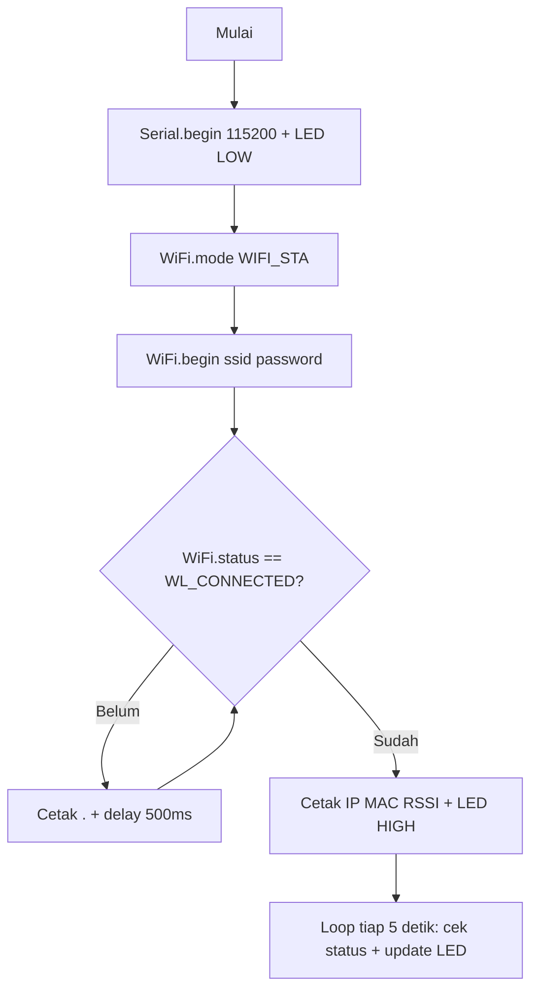
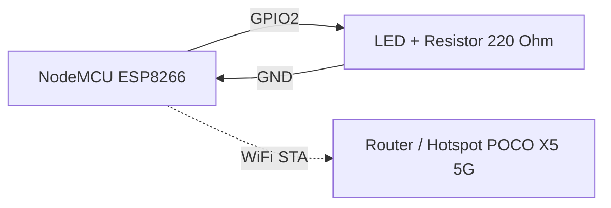
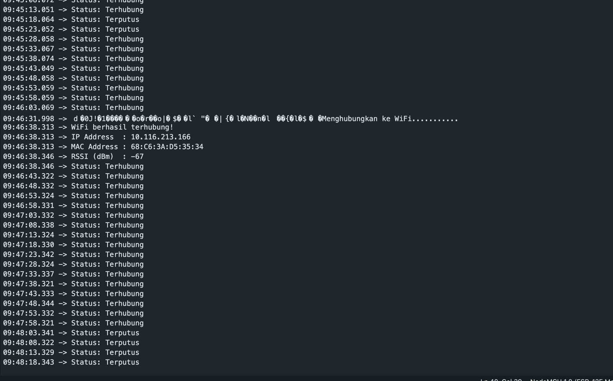

# Praktikum IoT - Modul 2: Konfigurasi Jaringan

Dokumentasi praktikum Modul 2 IoT: konfigurasi WiFi mode Station (STA) dan Access Point (AP) berbasis ESP8266 (NodeMCU).

> Catatan: Di modul pake memakai ESP32 (`WiFi.h`), padahal praktikum pake ESP8266 (`ESP8266WiFi.h`) dengan SSID `POCO X5 5G`.

---

## 1. Percobaan 1: Konfigurasi Mode Station (STA)

### A. Penjelasan Singkat Percobaan

Menghubungkan ESP8266 sebagai klien (Station) ke jaringan WiFi yang sudah tersedia, lalu menampilkan status koneksi, IP address, MAC address, dan RSSI ke Serial Monitor. LED indikator menyala saat berhasil terhubung, dan status koneksi dipantau ulang setiap 5 detik.

### B. Library & Dependencies

- **ESP8266WiFi** (`ESP8266WiFi.h`, bawaan core ESP8266 di Arduino IDE, tanpa install tambahan)

### C. Penjelasan Kode & Fungsi (`percobaan1.cpp`)

```cpp
#include <ESP8266WiFi.h>

const char* ssid     = "POCO X5 5G";
const char* password = "cobaliathplu";

const int ledPin = 2;    // GPIO 2

void setup() {
  Serial.begin(115200);
  pinMode(ledPin, OUTPUT);
  digitalWrite(ledPin, LOW);

  // Set WiFi sebagai Station
  WiFi.mode(WIFI_STA);
  WiFi.begin(ssid, password);

  Serial.print("Menghubungkan ke WiFi");

  while (WiFi.status() != WL_CONNECTED) {
    delay(500);
    Serial.print(".");
  }

  Serial.println();
  Serial.println("WiFi berhasil terhubung!");

  Serial.print("IP Address  : ");
  Serial.println(WiFi.localIP());

  Serial.print("MAC Address : ");
  Serial.println(WiFi.macAddress());

  Serial.print("RSSI (dBm)  : ");
  Serial.println(WiFi.RSSI());

  digitalWrite(ledPin, HIGH);
}

void loop() {
  if (WiFi.status() == WL_CONNECTED) {
    Serial.println("Status: Terhubung");
    digitalWrite(ledPin, HIGH);
  } else {
    Serial.println("Status: Terputus");
    digitalWrite(ledPin, LOW);
  }

  delay(5000);
}
```

- `#include <ESP8266WiFi.h>`: Memuat pustaka WiFi untuk chip ESP8266.
- `const char* ssid / password`: Menyimpan nama dan kata sandi jaringan WiFi tujuan (hotspot yang disiapkan pada tugas pendahuluan).
- `const int ledPin = 2`: Mapping pin LED indikator ke GPIO2.
- `Serial.begin(115200)`: Inisialisasi UART 115200 baud untuk log Serial Monitor.
- `pinMode(ledPin, OUTPUT)` & `digitalWrite(ledPin, LOW)`: Mengatur LED sebagai output dan mematikannya selama proses koneksi.
- `WiFi.mode(WIFI_STA)`: Mengatur ESP8266 ke mode Station (klien).
- `WiFi.begin(ssid, password)`: Memulai koneksi ke jaringan WiFi yang ditentukan.
- `WiFi.status() != WL_CONNECTED`: Mengecek status koneksi; `WL_CONNECTED` tanda sudah terhubung dan dapat IP.
- `WiFi.localIP()`: Mengembalikan alamat IP yang diperoleh dari router/DHCP.
- `WiFi.macAddress()`: Mengembalikan alamat MAC hardware ESP8266.
- `WiFi.RSSI()`: Mengembalikan kekuatan sinyal dalam dBm (makin mendekati 0 makin kuat).
- `digitalWrite(ledPin, HIGH)`: Menyalakan LED indikator saat koneksi berhasil.
- `delay(5000)` di `loop()`: Interval pemantauan status koneksi setiap 5 detik.

### D. Penjelasan Percabangan / Conditional

- `while (WiFi.status() != WL_CONNECTED)`: Selama belum terhubung, cetak `.` tiap 500 ms sebagai indikator proses. Keluar dari loop hanya jika sudah `WL_CONNECTED`.
- `if (WiFi.status() == WL_CONNECTED)` di `loop()`:
  - Jika masih terhubung: cetak `Status: Terhubung` dan jaga LED tetap menyala (`HIGH`).
  - `else`: Jika terputus: cetak `Status: Terputus` dan matikan LED (`LOW`). Bagian inilah modifikasi reconnect-monitoring: setiap 5 detik status dicek ulang sehingga putus/sambung terdeteksi otomatis.

---

## 2. Percobaan 2: Konfigurasi Mode Access Point (AP)

### A. Penjelasan Singkat Percobaan

Mengaktifkan ESP8266 sebagai Access Point (hotspot mandiri) dengan SSID dan password tertentu, lalu menampilkan IP AP ke Serial Monitor dan memantau jumlah perangkat (client) yang terhubung setiap 5 detik.

### B. Library & Dependencies

- **ESP8266WiFi** (`ESP8266WiFi.h`, bawaan core ESP8266 di Arduino IDE)

### C. Penjelasan Kode & Fungsi (`percobaan2.cpp`)

```cpp
#include <ESP8266WiFi.h>

const char* ssid     = "POCO X5 5G";
const char* password = "cobaliathplu";

void setup() {
  Serial.begin(115200);

  // Set mode WiFi menjadi Access Point
  WiFi.mode(WIFI_AP);
  WiFi.softAP(ssid, password);

  IPAddress apIP = WiFi.softAPIP();

  Serial.println();
  Serial.println("Access Point aktif!");
  Serial.print("SSID        : ");
  Serial.println(ssid);

  Serial.print("IP Address  : ");
  Serial.println(apIP);
}

void loop() {
  // Menampilkan jumlah perangkat yang terhubung setiap 5 detik
  int jumlahClient = WiFi.softAPgetStationNum();

  Serial.print("Jumlah perangkat terhubung: ");
  Serial.println(jumlahClient);

  delay(5000);
}
```

- `#include <ESP8266WiFi.h>`: Pustaka WiFi ESP8266 (menyediakan fungsi AP).
- `const char* ssid / password`: Nama dan kata sandi AP yang dipancarkan ESP8266.
- `Serial.begin(115200)`: Inisialisasi serial 115200 baud.
- `WiFi.mode(WIFI_AP)`: Mengatur ESP8266 ke mode Access Point (penyedia jaringan).
- `WiFi.softAP(ssid, password)`: Mengaktifkan hotspot lunak dengan SSID/password tersebut.
- `WiFi.softAPIP()`: Mengembalikan alamat IP gateway AP (default `192.168.4.1`).
- `WiFi.softAPgetStationNum()`: Mengembalikan jumlah station/client yang sedang terhubung ke AP.
- `delay(5000)`: Interval pelaporan jumlah client setiap 5 detik.

### D. Penjelasan Percabangan / Conditional

- Pada program ini tidak ada `if/else` eksplisit. Alur bercabang secara implisit: `setup()` hanya berjalan sekali untuk mengaktifkan AP, sedangkan `loop()` mengulang pembacaan `softAPgetStationNum()` — nilainya 0 jika belum ada perangkat, > 0 jika ada smartphone/laptop yang berhasil konek ke SSID tersebut.

---

## 3. Jawaban Pertanyaan Praktikum

### 3.1 Percobaan 2A — Mode Station (2.5.4)

#### 1. Gambarkan diagram alur (flowchart) proses koneksi ESP32 ke jaringan WiFi pada program di atas!



Alur: inisialisasi serial/LED → set mode STA → panggil `begin()` → tunggu (blocking `while`) sampai `WL_CONNECTED` → tampilkan parameter jaringan → pantau status berkala di `loop()`.

#### 2. Apa fungsi dari perintah `WiFi.mode(WIFI_STA)` pada program tersebut?

Mengatur radio WiFi ESP sebagai Station (klien), yaitu hanya bergabung ke jaringan yang sudah ada, bukan memancarkan jaringan sendiri. Tanpa baris ini mode sebelumnya (misal AP) bisa terbawa sehingga koneksi ke router gagal.

#### 3. Jelaskan apa yang terjadi apabila SSID atau password yang dimasukkan salah!

`WiFi.status()` tidak akan pernah menjadi `WL_CONNECTED`, sehingga program tertahan di loop `while` dan Serial Monitor hanya mencetak `........` terus-menerus. Tidak ada IP/MAC/RSSI yang tampil dan LED tidak menyala.

#### 4. Modifikasi program agar ESP32 mencoba menghubungkan ulang (reconnect) secara otomatis apabila koneksi WiFi terputus

Modifikasi sudah ada pada `percobaan1.cpp` di bagian `loop()`:

```cpp
void loop() {
  if (WiFi.status() == WL_CONNECTED) {
    Serial.println("Status: Terhubung");
    digitalWrite(ledPin, HIGH);
  } else {
    Serial.println("Status: Terputus");
    digitalWrite(ledPin, LOW);
  }

  delay(5000);
}
```

#### Penjelasan Setiap Baris Kode Modifikasi:

- `void loop() { ... }`: Fungsi yang diulang terus selama mikrokontroler hidup; dipakai sebagai pemantau berkala.
- `if (WiFi.status() == WL_CONNECTED)`: Mengecek ulang status radio setiap iterasi; `true` berarti link ke router masih hidup.
- `Serial.println("Status: Terhubung")`: Log bahwa koneksi masih OK pada periode 5 detik berjalan.
- `digitalWrite(ledPin, HIGH)`: Menjaga LED indikator tetap menyala selama terhubung.
- `else`: Berjalan jika status bukan `WL_CONNECTED` (terputus/gagal DHCP/SSID hilang).
- `Serial.println("Status: Terputus")`: Log bahwa koneksi putus pada periode berjalan.
- `digitalWrite(ledPin, LOW)`: Mematikan LED sebagai indikator visual putus.
- `delay(5000)`: Memberi jeda 5 detik antar pengecekan agar log tidak membanjiri serial dan memberi waktu stack WiFi mencoba bergabung ulang secara otomatis.

### 3.2 Percobaan 2B — Mode Access Point (2.6.4)

#### 1. Mengapa alamat IP default Access Point pada ESP32 umumnya bernilai 192.168.4.1?

Karena itu alamat privat yang dicadangkan stack `softAP` (subnet `192.168.4.0/24`) agar tidak bentrok dengan subnet router rumah yang umum (`192.168.1.0/24` atau `192.168.0.0/24`). ESP sekaligus menjadi gateway + DHCP server di alamat `.1` tersebut.

#### 2. Apa perbedaan mendasar antara mode Station dan mode Access Point pada ESP32?

- **Station (STA):** ESP sebagai klien, ikut jaringan orang lain (router/hotspot), dapat IP via DHCP dari router, dipakai untuk akses internet/server.
- **Access Point (AP):** ESP sebagai penyedia jaringan, memancarkan SSID sendiri, memberi IP ke perangkat lain, dipakai untuk akses langsung/provisioning tanpa router.

#### 3. Jelaskan risiko keamanan apabila password Access Point tidak diberikan atau terlalu sederhana!

AP terbuka/bypass mudah dimasuki siapa saja: penyadap trafik, pemakai bandwidth liar, hingga penyerang yang mengeksploitasi layanan di ESP (misal web config). Password pendek/mudah ditebak juga rentan brute-force/dictionary.

#### 4. Modifikasi program agar ESP32 berjalan pada mode AP+STA (terhubung ke WiFi rumah sekaligus menyediakan Access Point)

Contoh jawaban modifikasi (ditampilkan di README saja, file `percobaan2.cpp` tidak diubah):

```cpp
#include <ESP8266WiFi.h>

const char* sta_ssid = "POCO X5 5G";       // WiFi rumah (target STA)
const char* sta_password = "cobaliathplu";
const char* ap_ssid = "ESP8266_AP_STA";    // SSID yang dipancarkan ESP
const char* ap_password = "12345678";      // minimal 8 karakter

void setup() {
  Serial.begin(115200);

  WiFi.mode(WIFI_AP_STA);        // Aktifkan STA + AP bersamaan
  WiFi.begin(sta_ssid, sta_password); // Gabung ke WiFi rumah

  while (WiFi.status() != WL_CONNECTED) {
    delay(500);
    Serial.print(".");
  }

  WiFi.softAP(ap_ssid, ap_password); // Pancarkan AP sendiri

  Serial.println();
  Serial.println("Mode AP+STA aktif!");
  Serial.print("IP STA  : ");
  Serial.println(WiFi.localIP());
  Serial.print("IP AP   : ");
  Serial.println(WiFi.softAPIP());
}

void loop() {
  Serial.print("STA: ");
  Serial.print(WiFi.status() == WL_CONNECTED ? "Terhubung" : "Terputus");
  Serial.print(" | Client AP: ");
  Serial.println(WiFi.softAPgetStationNum());
  delay(5000);
}
```

#### Penjelasan Setiap Baris Kode Modifikasi:

- `#include <ESP8266WiFi.h>`: Pustaka WiFi ESP8266 yang mendukung mode gabungan.
- `sta_ssid / sta_password`: Kredensial router tujuan sisi Station.
- `ap_ssid / ap_password`: SSID/password yang dipancarkan sisi AP (password minimal 8 karakter agar WPA2 valid).
- `Serial.begin(115200)`: Inisialisasi log serial.
- `WiFi.mode(WIFI_AP_STA)`: Kunci modifikasi — radio berjalan sebagai klien sekaligus hotspot.
- `WiFi.begin(sta_ssid, sta_password)`: Sisi STA mulai bergabung ke router.
- `while (WiFi.status() != WL_CONNECTED)`: Tunggu sisi STA tersambung sebelum lanjut.
- `WiFi.softAP(ap_ssid, ap_password)`: Sisi AP mulai memancar walau STA sudah sibuk.
- `WiFi.localIP()`: IP yang didapat dari router (sisi STA).
- `WiFi.softAPIP()`: IP gateway sisi AP (umumnya `192.168.4.1`).
- `WiFi.softAPgetStationNum()`: Jumlah client yang nempel ke AP ESP.
- `delay(5000)`: Pelaporan ganda (status STA + jumlah client AP) tiap 5 detik.

### 3.3 Pertanyaan Analisis (2.7)

#### 1. Uraikan hasil tugas pada praktikum yang telah dilakukan pada setiap percobaan!

- **Percobaan 1 (STA):** ESP berhasil gabung ke SSID yang ditentukan; Serial menampilkan `WiFi berhasil terhubung!` + IP/MAC/RSSI; LED GPIO2 menyala; `loop()` melaporkan `Status: Terhubung` tiap 5 detik dan berubah ke `Terputus` + LED mati jika hotspot dimatikan.
- **Percobaan 2 (AP):** ESP memancarkan SSID; smartphone/laptop dapat menemukan dan konek; Serial menampilkan `Access Point aktif!` + SSID + IP AP; `Jumlah perangkat terhubung` bertambah dari 0 ke 1+ setelah client gabung.

#### 2. Bagaimana pengaruh kekuatan sinyal (RSSI) terhadap kestabilan koneksi WiFi pada perangkat IoT?

RSSI negatif mendekati 0 (misal -40 dBm) berarti sinyal kuat: packet loss kecil, latensi rendah, jarang putus. Di bawah -80 dBm koneksi rapuh: retransmit sering, throughput jatuh, risiko `WL_DISCONNECTED` dan data sensor gagal terkirim.

#### 3. Bagaimana cara kerja ESP32 dalam membedakan peran sebagai klien (Station) dan sebagai penyedia jaringan (Access Point)?

Lewat register mode radio (`WIFI_STA`, `WIFI_AP`, `WIFI_AP_STA`): mode STA mengaktifkan wpa_supplicant + DHCP client untuk gabung ke BSSID orang lain, mode AP mengaktifkan beacon + DHCP server + NAT untuk melayani BSSID sendiri. API (`begin` vs `softAP`, `localIP` vs `softAPIP`) memetakan ke masing-masing interface (STA `esp_netif_sta`, AP `esp_netif_ap`).

#### 4. Bagaimana kombinasi mode Station dan Access Point (AP+STA) dapat dimanfaatkan dalam skenario nyata sistem IoT, misalnya pada proses konfigurasi awal perangkat (provisioning)?

ESP memancarkan AP captive-portal untuk input kredensial WiFi rumah dari HP, sambil sisi STA langsung mencoba kredensial tersebut. Setelah sukses, AP bisa dimatikan dan perangkat murni STA. Pola ini dipakai smart lamp/plug/Tasmota/ESPHome agar user tak perlu hardcode SSID.

---

## 4. Skematik & Diagram Rangkaian

### Rangkaian Percobaan 1 (STA + LED indikator)



### Rangkaian Percobaan 2 (AP)


### Doksli Percobaan

#### Doksli Percobaan 1



#### Doksli Percobaan 2


#### Doksli Vidio

<video src="doksli_vid.mp4" controls width="640"></video>
