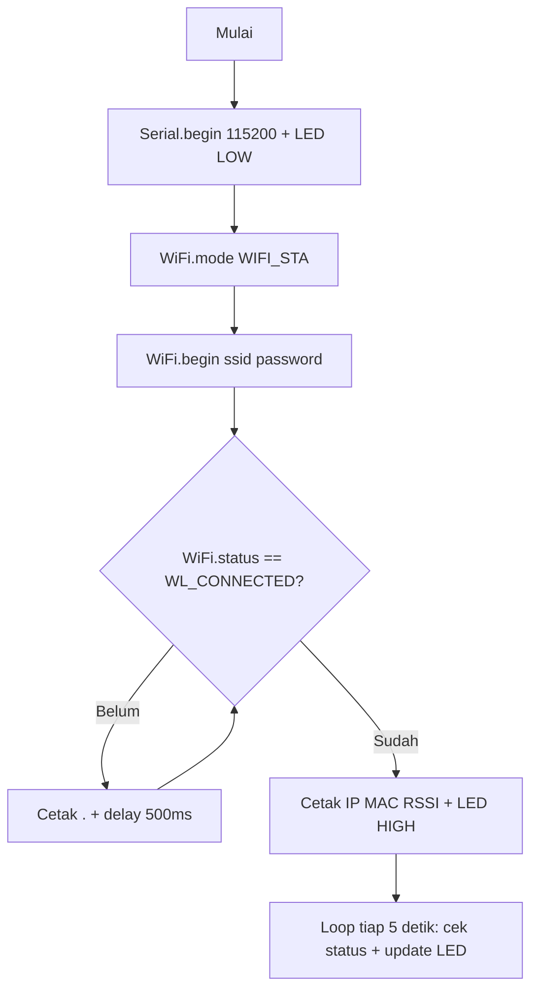
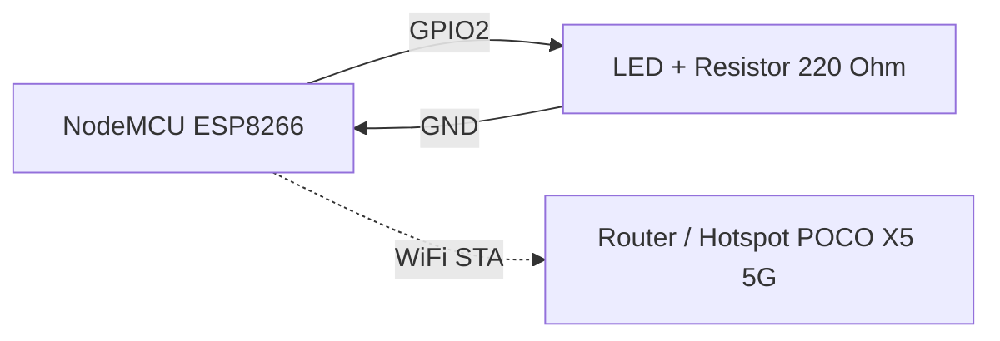
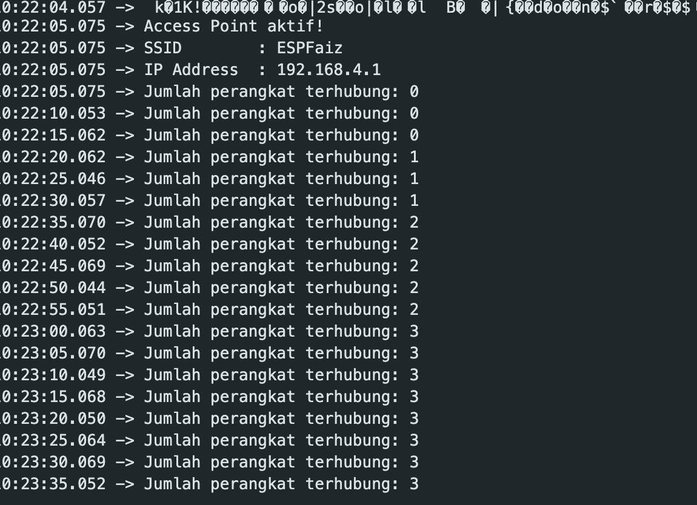

# Praktikum IoT - Modul 2: Konfigurasi Jaringan

Dokumentasi praktikum Modul 2 IoT: konfigurasi WiFi mode Station (STA) dan Access Point (AP) berbasis ESP8266 (NodeMCU).

> Catatan: Di modul pake ESP32 (`WiFi.h`), padahal praktikum pake ESP8266 (`ESP8266WiFi.h`) dengan SSID `POCO X5 5G`.

---

## 1. Percobaan 1: Konfigurasi Mode Station (STA)

### A. Penjelasan Singkat Percobaan

Menghubungkan ESP8266 sebagai klien (Station) ke jaringan WiFi yang sudah tersedia, lalu menampilkan status koneksi, IP address, MAC address, dan RSSI ke Serial Monitor. LED indikator menyala saat berhasil terhubung, dan status koneksi dipantau ulang setiap 5 detik.

### B. Library & Dependencies

- **ESP8266WiFi** (`ESP8266WiFi.h`, bawaan core ESP8266 di Arduino IDE, tanpa install tambahan)

### C. Penjelasan Kode & Fungsi (`percobaan1.cpp`)

```cpp
#include <ESP8266WiFi.h>

const char* ssid     = "POCO X5 5G";
const char* password = "cobaliathplu";

const int ledPin = 2;    // GPIO 2

void setup() {
  Serial.begin(115200);
  pinMode(ledPin, OUTPUT);
  digitalWrite(ledPin, LOW);

  // Set WiFi sebagai Station
  WiFi.mode(WIFI_STA);
  WiFi.begin(ssid, password);

  Serial.print("Menghubungkan ke WiFi");

  while (WiFi.status() != WL_CONNECTED) {
    delay(500);
    Serial.print(".");
  }

  Serial.println();
  Serial.println("WiFi berhasil terhubung!");

  Serial.print("IP Address  : ");
  Serial.println(WiFi.localIP());

  Serial.print("MAC Address : ");
  Serial.println(WiFi.macAddress());

  Serial.print("RSSI (dBm)  : ");
  Serial.println(WiFi.RSSI());

  digitalWrite(ledPin, HIGH);
}

void loop() {
  if (WiFi.status() == WL_CONNECTED) {
    Serial.println("Status: Terhubung");
    digitalWrite(ledPin, HIGH);
  } else {
    Serial.println("Status: Terputus");
    digitalWrite(ledPin, LOW);
  }

  delay(5000);
}
```

- `#include <ESP8266WiFi.h>`: Memuat pustaka WiFi untuk chip ESP8266.
- `const char* ssid / password`: Menyimpan nama dan kata sandi jaringan WiFi tujuan (hotspot yang disiapkan pada tugas pendahuluan).
- `const int ledPin = 2`: Mapping pin LED indikator ke GPIO2.
- `Serial.begin(115200)`: Inisialisasi UART 115200 baud untuk log Serial Monitor.
- `pinMode(ledPin, OUTPUT)` & `digitalWrite(ledPin, LOW)`: Mengatur LED sebagai output dan mematikannya selama proses koneksi.
- `WiFi.mode(WIFI_STA)`: Mengatur ESP8266 ke mode Station (klien).
- `WiFi.begin(ssid, password)`: Memulai koneksi ke jaringan WiFi yang ditentukan.
- `WiFi.status() != WL_CONNECTED`: Mengecek status koneksi; `WL_CONNECTED` tanda sudah terhubung dan dapat IP.
- `WiFi.localIP()`: Mengembalikan alamat IP yang diperoleh dari router/DHCP.
- `WiFi.macAddress()`: Mengembalikan alamat MAC hardware ESP8266.
- `WiFi.RSSI()`: Mengembalikan kekuatan sinyal dalam dBm (makin mendekati 0 makin kuat).
- `digitalWrite(ledPin, HIGH)`: Menyalakan LED indikator saat koneksi berhasil.
- `delay(5000)` di `loop()`: Interval pemantauan status koneksi setiap 5 detik.

### D. Penjelasan Percabangan / Conditional

- `while (WiFi.status() != WL_CONNECTED)`: Selama belum terhubung, cetak `.` tiap 500 ms sebagai indikator proses. Keluar dari loop hanya jika sudah `WL_CONNECTED`.
- `if (WiFi.status() == WL_CONNECTED)` di `loop()`:
  - Jika masih terhubung: cetak `Status: Terhubung` dan jaga LED tetap menyala (`HIGH`).
  - `else`: Jika terputus: cetak `Status: Terputus` dan matikan LED (`LOW`). Bagian inilah modifikasi reconnect-monitoring: setiap 5 detik status dicek ulang sehingga putus/sambung terdeteksi otomatis.

---

## 2. Percobaan 2: Konfigurasi Mode Access Point (AP)

### A. Penjelasan Singkat Percobaan

Mengaktifkan ESP8266 sebagai Access Point (hotspot mandiri) dengan SSID dan password tertentu, lalu menampilkan IP AP ke Serial Monitor dan memantau jumlah perangkat (client) yang terhubung setiap 5 detik.

### B. Library & Dependencies

- **ESP8266WiFi** (`ESP8266WiFi.h`, bawaan core ESP8266 di Arduino IDE)

### C. Penjelasan Kode & Fungsi (`percobaan2.cpp`)

```cpp
#include <ESP8266WiFi.h>

const char* ssid     = "POCO X5 5G";
const char* password = "cobaliathplu";

void setup() {
  Serial.begin(115200);

  // Set mode WiFi menjadi Access Point
  WiFi.mode(WIFI_AP);
  WiFi.softAP(ssid, password);

  IPAddress apIP = WiFi.softAPIP();

  Serial.println();
  Serial.println("Access Point aktif!");
  Serial.print("SSID        : ");
  Serial.println(ssid);

  Serial.print("IP Address  : ");
  Serial.println(apIP);
}

void loop() {
  // Menampilkan jumlah perangkat yang terhubung setiap 5 detik
  int jumlahClient = WiFi.softAPgetStationNum();

  Serial.print("Jumlah perangkat terhubung: ");
  Serial.println(jumlahClient);

  delay(5000);
}
```

- `#include <ESP8266WiFi.h>`: Pustaka WiFi ESP8266 (menyediakan fungsi AP).
- `const char* ssid / password`: Nama dan kata sandi AP yang dipancarkan ESP8266.
- `Serial.begin(115200)`: Inisialisasi serial 115200 baud.
- `WiFi.mode(WIFI_AP)`: Mengatur ESP8266 ke mode Access Point (penyedia jaringan).
- `WiFi.softAP(ssid, password)`: Mengaktifkan hotspot lunak dengan SSID/password tersebut.
- `WiFi.softAPIP()`: Mengembalikan alamat IP gateway AP (default `192.168.4.1`).
- `WiFi.softAPgetStationNum()`: Mengembalikan jumlah station/client yang sedang terhubung ke AP.
- `delay(5000)`: Interval pelaporan jumlah client setiap 5 detik.

### D. Penjelasan Percabangan / Conditional

- Pada program ini tidak ada `if/else` eksplisit. Alur bercabang secara implisit: `setup()` hanya berjalan sekali untuk mengaktifkan AP, sedangkan `loop()` mengulang pembacaan `softAPgetStationNum()` — nilainya 0 jika belum ada perangkat, > 0 jika ada smartphone/laptop yang berhasil konek ke SSID tersebut.

---

## 3. Jawaban Pertanyaan Praktikum

### 3.1 Percobaan 2A — Mode Station (2.5.4)

#### 1. Gambarkan diagram alur (flowchart) proses koneksi ESP32 ke jaringan WiFi pada program di atas!



Urutannya: serial dan LED diinisialisasi lebih dulu, lalu mode STA diaktifkan dan `begin()` dipanggil untuk memulai koneksi. Program akan berhenti sejenak (blocking) di `while` sampai statusnya `WL_CONNECTED`, baru kemudian IP, MAC, dan RSSI ditampilkan. Setelah itu `loop()` bertugas memantau status koneksi secara berkala.

#### 2. Apa fungsi dari perintah `WiFi.mode(WIFI_STA)` pada program tersebut?

Baris ini memaksa radio WiFi ESP bekerja sebagai Station (klien), artinya perangkat hanya ikut bergabung ke jaringan yang sudah ada, bukan membuat jaringannya sendiri. Kalau baris ini dilewati, mode dari sesi sebelumnya (misalnya AP) bisa saja masih terbawa, dan akibatnya koneksi ke router bisa gagal.

#### 3. Jelaskan apa yang terjadi apabila SSID atau password yang dimasukkan salah!

`WiFi.status()` tidak akan pernah berubah menjadi `WL_CONNECTED`. Akibatnya program terjebak di loop `while` dan Serial Monitor cuma menampilkan titik-titik (`........`) tanpa henti. IP, MAC, dan RSSI tidak akan pernah muncul, dan LED pun tetap padam.

#### 4. Modifikasi program agar ESP32 mencoba menghubungkan ulang (reconnect) secara otomatis apabila koneksi WiFi terputus

Perubahan ini sudah diterapkan langsung pada bagian `loop()` di `percobaan1.cpp`:

```cpp
void loop() {
  if (WiFi.status() == WL_CONNECTED) {
    Serial.println("Status: Terhubung");
    digitalWrite(ledPin, HIGH);
  } else {
    Serial.println("Status: Terputus");
    digitalWrite(ledPin, LOW);
  }

  delay(5000);
}
```

#### Penjelasan Setiap Baris Kode Modifikasi:

- `void loop() { ... }`: Fungsi ini terus berjalan selama mikrokontroler menyala, sehingga cocok dipakai untuk memantau kondisi secara berkala.
- `if (WiFi.status() == WL_CONNECTED)`: Status radio dicek ulang di setiap putaran; kalau hasilnya `true`, berarti koneksi ke router masih aktif.
- `Serial.println("Status: Terhubung")`: Mencatat di serial bahwa koneksi masih baik-baik saja pada pengecekan 5 detik itu.
- `digitalWrite(ledPin, HIGH)`: Membuat LED tetap menyala selama koneksi masih terjalin.
- `else`: Dijalankan kalau status bukan `WL_CONNECTED`, misalnya karena putus, DHCP gagal, atau SSID sudah tidak terjangkau.
- `Serial.println("Status: Terputus")`: Mencatat di serial bahwa koneksi sedang putus pada pengecekan tersebut.
- `digitalWrite(ledPin, LOW)`: Mematikan LED sebagai penanda visual bahwa koneksi terputus.
- `delay(5000)`: Memberi jeda 5 detik antar pengecekan supaya log tidak terus-menerus membanjiri serial, sekaligus memberi waktu bagi stack WiFi untuk mencoba bergabung ulang dengan sendirinya.

### 3.2 Percobaan 2B — Mode Access Point (2.6.4)

#### 1. Mengapa alamat IP default Access Point pada ESP32 umumnya bernilai 192.168.4.1?

Alamat itu dicadangkan oleh stack `softAP` sebagai bagian dari subnet `192.168.4.0/24`, dipilih supaya tidak bentrok dengan subnet router rumah yang umum dipakai seperti `192.168.1.0/24` atau `192.168.0.0/24`. Di alamat `.1` inilah ESP sekaligus berperan sebagai gateway dan DHCP server bagi perangkat yang terhubung.

#### 2. Apa perbedaan mendasar antara mode Station dan mode Access Point pada ESP32?

- **Station (STA):** ESP berperan sebagai klien yang bergabung ke jaringan milik orang lain (router atau hotspot), mendapat IP lewat DHCP dari router tersebut, dan biasanya dipakai untuk akses internet atau ke server.
- **Access Point (AP):** ESP justru menjadi penyedia jaringan. Ia memancarkan SSID sendiri dan membagikan IP ke perangkat lain yang terhubung, cocok untuk akses langsung atau proses provisioning tanpa perlu router.

#### 3. Jelaskan risiko keamanan apabila password Access Point tidak diberikan atau terlalu sederhana!

AP yang terbuka atau tanpa password bisa dimasuki siapa saja, mulai dari orang yang menyadap trafik, memakai bandwidth tanpa izin, sampai penyerang yang mencoba mengeksploitasi layanan di ESP seperti halaman web config. Password yang pendek atau mudah ditebak pun tetap rentan terhadap serangan brute-force maupun dictionary attack.

#### 4. Modifikasi program agar ESP32 berjalan pada mode AP+STA (terhubung ke WiFi rumah sekaligus menyediakan Access Point)

Berikut contoh modifikasinya (hanya ditulis di README, file `percobaan2.cpp` sendiri tidak diubah):

```cpp
#include <ESP8266WiFi.h>

const char* sta_ssid = "POCO X5 5G";       // WiFi rumah (target STA)
const char* sta_password = "cobaliathplu";
const char* ap_ssid = "ESP8266_AP_STA";    // SSID yang dipancarkan ESP
const char* ap_password = "12345678";      // minimal 8 karakter

void setup() {
  Serial.begin(115200);

  WiFi.mode(WIFI_AP_STA);        // Aktifkan STA + AP bersamaan
  WiFi.begin(sta_ssid, sta_password); // Gabung ke WiFi rumah

  while (WiFi.status() != WL_CONNECTED) {
    delay(500);
    Serial.print(".");
  }

  WiFi.softAP(ap_ssid, ap_password); // Pancarkan AP sendiri

  Serial.println();
  Serial.println("Mode AP+STA aktif!");
  Serial.print("IP STA  : ");
  Serial.println(WiFi.localIP());
  Serial.print("IP AP   : ");
  Serial.println(WiFi.softAPIP());
}

void loop() {
  Serial.print("STA: ");
  Serial.print(WiFi.status() == WL_CONNECTED ? "Terhubung" : "Terputus");
  Serial.print(" | Client AP: ");
  Serial.println(WiFi.softAPgetStationNum());
  delay(5000);
}
```

#### Penjelasan Setiap Baris Kode Modifikasi:

- `#include <ESP8266WiFi.h>`: Pustaka WiFi ESP8266 yang sama, sudah mendukung mode gabungan STA+AP.
- `sta_ssid / sta_password`: Kredensial router yang jadi tujuan sisi Station.
- `ap_ssid / ap_password`: SSID dan password yang akan dipancarkan sisi AP; passwordnya minimal 8 karakter supaya WPA2 tetap valid.
- `Serial.begin(115200)`: Menyiapkan log lewat serial seperti biasa.
- `WiFi.mode(WIFI_AP_STA)`: Ini bagian intinya — radio ESP dijalankan sebagai klien sekaligus hotspot dalam waktu bersamaan.
- `WiFi.begin(sta_ssid, sta_password)`: Sisi STA mulai mencoba bergabung ke router.
- `while (WiFi.status() != WL_CONNECTED)`: Program menunggu dulu sampai sisi STA benar-benar tersambung sebelum lanjut ke langkah berikutnya.
- `WiFi.softAP(ap_ssid, ap_password)`: Sisi AP mulai memancarkan jaringannya sendiri, meski sisi STA masih sibuk terhubung ke router.
- `WiFi.localIP()`: Menampilkan IP yang diperoleh dari router, yaitu sisi STA.
- `WiFi.softAPIP()`: Menampilkan IP gateway di sisi AP, biasanya `192.168.4.1`.
- `WiFi.softAPgetStationNum()`: Menghitung berapa client yang sedang terhubung ke AP milik ESP.
- `delay(5000)`: Mengatur agar status STA dan jumlah client AP dilaporkan bersamaan setiap 5 detik.

### 3.3 Pertanyaan Analisis (2.7)

#### 1. Uraikan hasil tugas pada praktikum yang telah dilakukan pada setiap percobaan!

- **Percobaan 1 (STA):** ESP berhasil bergabung ke SSID yang sudah ditentukan. Serial Monitor menampilkan pesan `WiFi berhasil terhubung!` beserta IP, MAC, dan RSSI, sementara LED di GPIO2 menyala. Di `loop()`, status `Terhubung` terus dilaporkan tiap 5 detik, dan begitu hotspot dimatikan, statusnya langsung berubah jadi `Terputus` dengan LED ikut padam.
- **Percobaan 2 (AP):** ESP memancarkan SSID-nya sendiri, dan perangkat lain seperti smartphone atau laptop bisa menemukan serta konek ke jaringan tersebut. Serial menampilkan `Access Point aktif!` lengkap dengan SSID dan IP AP-nya. Angka pada `Jumlah perangkat terhubung` naik dari 0 menjadi 1 atau lebih begitu ada client yang berhasil bergabung.

#### 2. Bagaimana pengaruh kekuatan sinyal (RSSI) terhadap kestabilan koneksi WiFi pada perangkat IoT?

Semakin mendekati 0 nilai RSSI-nya (misalnya -40 dBm), semakin kuat sinyalnya, sehingga packet loss kecil, latensi rendah, dan koneksi jarang putus. Sebaliknya, di bawah -80 dBm koneksi jadi rapuh: retransmit lebih sering terjadi, throughput menurun, dan risiko `WL_DISCONNECTED` atau data sensor gagal terkirim pun meningkat.

#### 3. Bagaimana cara kerja ESP32 dalam membedakan peran sebagai klien (Station) dan sebagai penyedia jaringan (Access Point)?

Perbedaan peran ini diatur lewat register mode radio, yaitu `WIFI_STA`, `WIFI_AP`, atau `WIFI_AP_STA`. Saat mode STA aktif, ESP menjalankan wpa_supplicant bersama DHCP client untuk bisa bergabung ke BSSID milik jaringan lain. Sebaliknya, mode AP mengaktifkan beacon, DHCP server, dan NAT agar ESP bisa melayani BSSID-nya sendiri. Fungsi-fungsi API seperti `begin` versus `softAP`, atau `localIP` versus `softAPIP`, masing-masing dipetakan ke interface yang berbeda: `esp_netif_sta` untuk sisi STA dan `esp_netif_ap` untuk sisi AP.

#### 4. Bagaimana kombinasi mode Station dan Access Point (AP+STA) dapat dimanfaatkan dalam skenario nyata sistem IoT, misalnya pada proses konfigurasi awal perangkat (provisioning)?

Dalam skenario provisioning, ESP bisa memancarkan AP berbentuk captive-portal agar pengguna bisa memasukkan kredensial WiFi rumah lewat HP, sementara sisi STA di saat yang sama langsung mencoba kredensial tersebut. Kalau berhasil, AP-nya bisa dimatikan dan perangkat kembali berjalan murni sebagai STA. Pola semacam ini yang biasa dipakai pada smart lamp, smart plug, Tasmota, atau ESPHome, supaya pengguna tidak perlu menuliskan SSID langsung di kode program.

---

## 4. Skematik & Diagram Rangkaian

### Rangkaian Percobaan 1 (STA + LED indikator)



### Rangkaian Percobaan 2 (AP)


### Doksli Percobaan

#### Doksli Percobaan 1


#### Doksli Percobaan 2



#### Doksli Vidio

<video src="doksli_vid.mp4" controls width="640"></video>