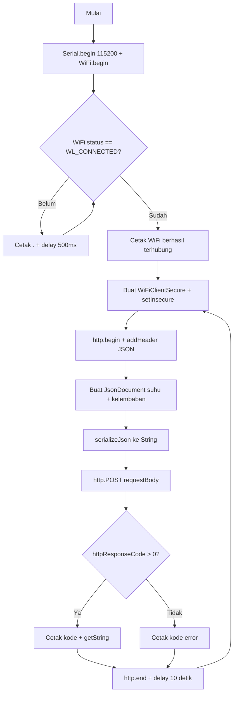
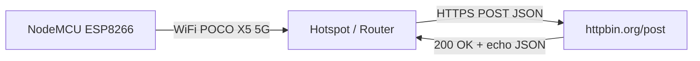
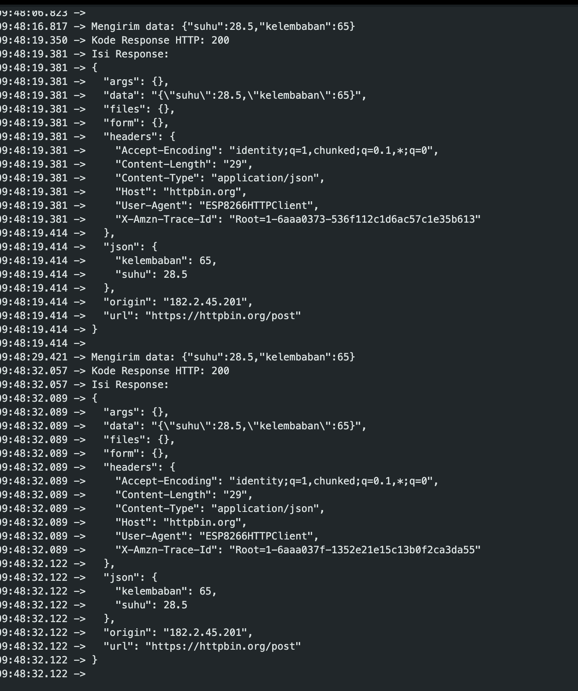
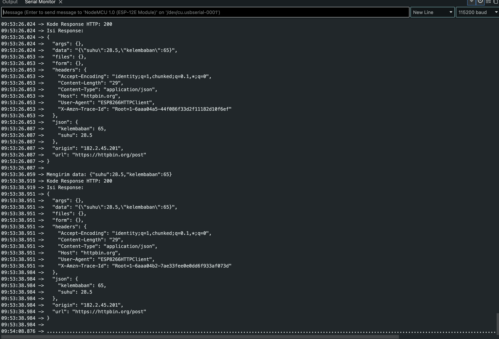

# Praktikum IoT - Modul 3: Protokol Komunikasi IoT (HTTP dan MQTT dengan Format JSON)

Dokumentasi praktikum Modul 3 IoT: pengiriman data sensor (suhu dan kelembaban) dalam format JSON dari mikrokontroler ke server menggunakan protokol HTTP (POST) dan ke broker menggunakan protokol MQTT (publish-subscribe) berbasis ESP8266 (NodeMCU).

> Catatan: Di modul pake ESP32 (`WiFi.h`, `HTTPClient.h`), padahal praktikum pake ESP8266 (`ESP8266WiFi.h`, `ESP8266HTTPClient.h`) dengan SSID `POCO X5 5G`. Untuk HTTPS (`https://httpbin.org/post`) di ESP8266 wajib memakai `WiFiClientSecure` + `setInsecure()`.

---

## 1. Percobaan 3A: Komunikasi Data Menggunakan HTTP

### A. Penjelasan Singkat Percobaan

Menghubungkan ESP8266 ke jaringan WiFi, lalu mengirimkan data dummy sensor (suhu 28.5 °C dan kelembaban 65.0 %) dalam format JSON ke endpoint uji `https://httpbin.org/post` menggunakan HTTP POST setiap 10 detik. Serial Monitor menampilkan data yang dikirim, kode response HTTP, dan isi response (echo dari server).

### B. Library & Dependencies

- **ESP8266WiFi** (`ESP8266WiFi.h`, bawaan core ESP8266)
- **ESP8266HTTPClient** (`ESP8266HTTPClient.h`, bawaan core ESP8266)
- **WiFiClientSecure** (`WiFiClientSecure.h`, bawaan core ESP8266, untuk HTTPS)
- **ArduinoJson by Benoit Blanchon** (`ArduinoJson.h`, install via Library Manager)

### C. Penjelasan Kode & Fungsi (`percobaan1.cpp`)

```cpp
#include <ESP8266WiFi.h>
#include <ESP8266HTTPClient.h>
#include <WiFiClientSecure.h>
#include <ArduinoJson.h>

const char* ssid     = "POCO X5 5G";
const char* password = "cobaliathplu";
const char* serverUrl = "https://httpbin.org/post";  // endpoint uji HTTP POST

void setup() {
  Serial.begin(115200);

  WiFi.begin(ssid, password);

  Serial.print("Menghubungkan ke WiFi");
  while (WiFi.status() != WL_CONNECTED) {
    delay(500);
    Serial.print(".");
  }
  Serial.println();
  Serial.println("WiFi berhasil terhubung!");
}

void loop() {
  if (WiFi.status() == WL_CONNECTED) {
    WiFiClientSecure client;
    client.setInsecure(); // Mengabaikan verifikasi sertifikat SSL (diperlukan untuk HTTPS)

    HTTPClient http;

    // Perbaikan: Sertakan client pada http.begin()
    http.begin(client, serverUrl);
    http.addHeader("Content-Type", "application/json");

    // Membuat objek data sensor dalam format JSON
    JsonDocument doc;
    doc["suhu"] = 28.5;       // contoh data suhu (°C)
    doc["kelembaban"] = 65.0; // contoh data kelembaban (%)

    String requestBody;
    serializeJson(doc, requestBody);

    Serial.print("Mengirim data: ");
    Serial.println(requestBody);

    // Mengirim data melalui HTTP POST
    int httpResponseCode = http.POST(requestBody);

    if (httpResponseCode > 0) {
      Serial.print("Kode Response HTTP: ");
      Serial.println(httpResponseCode);
      Serial.println("Isi Response:");
      Serial.println(http.getString());
    } else {
      Serial.print("Pengiriman gagal, kode error: ");
      Serial.println(httpResponseCode);
    }

    http.end();
  }

  delay(10000);  // kirim data setiap 10 detik
}
```

- `#include <ESP8266WiFi.h>`: Pustaka WiFi untuk chip ESP8266 (pengganti `WiFi.h` versi ESP32 di modul).
- `#include <ESP8266HTTPClient.h>`: Pustaka HTTP client versi ESP8266 (pengganti `HTTPClient.h` versi ESP32 di modul).
- `#include <WiFiClientSecure.h>`: Pustaka koneksi TLS/SSL. Wajib karena `serverUrl` memakai `https://`.
- `#include <ArduinoJson.h>`: Pustaka pembuatan/parsing JSON.
- `const char* ssid / password`: Nama dan kata sandi WiFi yang disiapkan pada tugas pendahuluan.
- `const char* serverUrl`: Endpoint uji HTTP POST (`httpbin.org/post` akan meng-echo kembali JSON yang dikirim).
- `Serial.begin(115200)`: Inisialisasi UART 115200 baud untuk log Serial Monitor.
- `WiFi.begin(ssid, password)`: Memulai koneksi ke jaringan WiFi.
- `WiFiClientSecure client; + client.setInsecure()`: Membuat koneksi aman tanpa verifikasi sertifikat (praktis untuk uji, tidak untuk produksi).
- `HTTPClient http; + http.begin(client, serverUrl)`: Mengaitkan objek HTTP dengan koneksi secure dan URL tujuan. Beda dengan contoh modul (ESP32: `http.begin(serverUrl)` saja).
- `http.addHeader("Content-Type", "application/json")`: Memberitahu server bahwa body adalah JSON.
- `JsonDocument doc; + doc["suhu"] / doc["kelembaban"]`: Membuat objek JSON dengan pasangan key-value data sensor.
- `serializeJson(doc, requestBody)`: Mengubah objek JSON menjadi string teks siap kirim.
- `http.POST(requestBody)`: Mengirim body via metode POST. Mengembalikan kode response (>0 = server menjawab, <0 = error koneksi).
- `http.getString()`: Mengambil isi body balasan server (berisi echo JSON).
- `http.end()`: Menutup koneksi HTTP dan membebaskan resource.
- `delay(10000)`: Interval pengiriman setiap 10 detik.

### D. Penjelasan Percabangan / Conditional

- `while (WiFi.status() != WL_CONNECTED)`: Selama belum terhubung, cetak `.` tiap 500 ms. Keluar hanya jika sudah `WL_CONNECTED`.
- `if (WiFi.status() == WL_CONNECTED)` di `loop()`: Hanya kirim HTTP jika WiFi masih tersambung. Jika putus, iterasi dilewati dan dicoba lagi 10 detik berikutnya.
- `if (httpResponseCode > 0)`:
  - Jika `> 0` (misal 200): cetak kode response dan isi response via `http.getString()`.
  - `else`: cetak kode error negatif (misal -1 = koneksi gagal) sebagai diagnosa.

---

## 2. Percobaan 3B: Komunikasi Data Menggunakan MQTT

### A. Penjelasan Singkat Percobaan

Menghubungkan ESP8266 ke WiFi lalu ke broker HiveMQ Cloud (`97904deac669490f8ece9602e0e13b99.s1.eu.hivemq.cloud:8883`) secara TLS dengan username/password, kemudian mem-publish data dummy sensor dalam format JSON ke topic `unsoed/tk245004/kelompok7/sensor` setiap 5 detik. Serial Monitor menampilkan status koneksi, Client ID, dan hasil publish (`Data berhasil dikirim!` / `Gagal mengirim data!`). Data yang dipublish diverifikasi via aplikasi client MQTT yang subscribe ke topic yang sama.

### B. Library & Dependencies

- **ESP8266WiFi** (`ESP8266WiFi.h`, bawaan core ESP8266)
- **WiFiClientSecure** (`WiFiClientSecure.h`, bawaan core ESP8266, untuk MQTTS port 8883)
- **PubSubClient by Nick O'Leary** (`PubSubClient.h`, install via Library Manager)
- **ArduinoJson by Benoit Blanchon** (`ArduinoJson.h`, install via Library Manager)

### C. Penjelasan Kode & Fungsi (`percobaan2.cpp`)

```cpp
#include <ESP8266WiFi.h>
#include <WiFiClientSecure.h>
#include <PubSubClient.h>
#include <ArduinoJson.h>

// =========================
// WiFi
// =========================
const char* ssid = "POCO X5 5G";
const char* password = "cobaliathplu";

// =========================
// HiveMQ Cloud
// =========================
const char* mqttServer =
  "97904deac669490f8ece9602e0e13b99.s1.eu.hivemq.cloud";

const int mqttPort = 8883;

// Username dan password dari HiveMQ Cloud
const char* mqttUsername = "Kelompok7";
const char* mqttPassword = "Kelompok7";

// Topic MQTT
const char* mqttTopic =
  "unsoed/tk245004/kelompok7/sensor";

// =========================
// MQTT Client
// =========================
WiFiClientSecure espClient;
PubSubClient client(espClient);


// =========================
// Hubungkan WiFi
// =========================
void hubungkanWiFi() {

  WiFi.begin(ssid, password);

  Serial.print("Menghubungkan ke WiFi");

  while (WiFi.status() != WL_CONNECTED) {

    delay(500);
    Serial.print(".");
  }

  Serial.println();
  Serial.println("WiFi berhasil terhubung!");

  Serial.print("IP Address: ");
  Serial.println(WiFi.localIP());
}


// =========================
// Hubungkan MQTT
// =========================
void hubungkanMQTT() {

  while (!client.connected()) {

    Serial.println();
    Serial.print("Menghubungkan ke broker MQTT...");

    // Client ID dibuat unik
    String clientId =
      "ESP8266Client-" +
      String(ESP.getChipId(), HEX);

    Serial.print(" Client ID: ");
    Serial.println(clientId);

    // Connect dengan username dan password HiveMQ
    if (client.connect(
          clientId.c_str(),
          mqttUsername,
          mqttPassword)) {

      Serial.println("MQTT berhasil terhubung!");

      Serial.print("Broker : ");
      Serial.println(mqttServer);

      Serial.print("Port   : ");
      Serial.println(mqttPort);

      Serial.println("================================");

    } else {

      Serial.print("MQTT gagal, rc=");
      Serial.println(client.state());

      Serial.println("Mencoba lagi dalam 2 detik...");

      delay(2000);
    }
  }
}


// =========================
// Setup
// =========================
void setup() {

  Serial.begin(115200);

  delay(1000);

  Serial.println();
  Serial.println("================================");
  Serial.println(" ESP8266 MQTT - HiveMQ Cloud");
  Serial.println("================================");

  // -------------------------
  // WiFi
  // -------------------------
  hubungkanWiFi();

  // -------------------------
  // TLS
  // -------------------------
  // Untuk testing.
  // Tidak melakukan validasi sertifikat TLS.
  espClient.setInsecure();

  // -------------------------
  // MQTT Server
  // -------------------------
  client.setServer(
    mqttServer,
    mqttPort
  );

  // Hubungkan ke MQTT
  hubungkanMQTT();
}


// =========================
// Loop
// =========================
void loop() {

  // Pastikan MQTT tetap terhubung
  if (!client.connected()) {

    Serial.println();
    Serial.println("MQTT terputus!");

    hubungkanMQTT();
  }

  // Wajib dipanggil terus-menerus
  client.loop();


  // =========================
  // Membuat data sensor JSON
  // =========================

  JsonDocument doc;

  doc["suhu"] = 28.5;
  doc["kelembaban"] = 65.0;

  char buffer[128];

  serializeJson(doc, buffer);


  // =========================
  // Publish MQTT
  // =========================

  bool berhasil =
    client.publish(
      mqttTopic,
      buffer
    );


  if (berhasil) {

    Serial.println();
    Serial.println("Data berhasil dikirim!");

    Serial.print("Topic   : ");
    Serial.println(mqttTopic);

    Serial.print("Payload : ");
    Serial.println(buffer);

  } else {

    Serial.println();
    Serial.println("Gagal mengirim data!");
  }


  // Publish setiap 5 detik
  delay(5000);
}
```

- `#include <ESP8266WiFi.h>`: Pustaka WiFi ESP8266.
- `#include <WiFiClientSecure.h>`: Pustaka TLS. Wajib karena HiveMQ Cloud memakai MQTTS port 8883.
- `#include <PubSubClient.h>`: Pustaka MQTT publish-subscribe.
- `#include <ArduinoJson.h>`: Pustaka JSON.
- `const char* ssid / password`: Nama dan kata sandi WiFi tujuan.
- `const char* mqttServer / mqttPort`: Alamat cluster HiveMQ Cloud dan port TLS 8883 (bukan 1883 publik tanpa enkripsi).
- `const char* mqttUsername / mqttPassword`: Kredensial autentikasi HiveMQ Cloud (`Kelompok7` / `Kelompok7`).
- `const char* mqttTopic`: Alamat topic unik berisi nama kelompok agar tidak tercampur dengan kelompok lain.
- `WiFiClientSecure espClient; + PubSubClient client(espClient)`: Membuat koneksi TLS lalu dibungkus sebagai client MQTT.
- `hubungkanWiFi()`: Fungsi blokir sampai `WL_CONNECTED`, mencetak progres `.` tiap 500 ms, lalu menampilkan IP via `WiFi.localIP()`.
- `hubungkanMQTT()`: Loop sampai `client.connected()`. Membuat `clientId` unik dari `ESP.getChipId()` (`ESP8266Client-XXXXXX`) agar tidak ditolak broker karena ID kembar.
- `client.connect(clientId, mqttUsername, mqttPassword)`: Connect dengan autentikasi username/password HiveMQ Cloud.
- `espClient.setInsecure()`: Melewati validasi sertifikat TLS (praktis untuk uji, tidak untuk produksi).
- `client.setServer(mqttServer, mqttPort)`: Mendaftarkan alamat broker yang akan dihubungi.
- `client.loop()`: Memproses paket keep-alive/incoming MQTT, wajib dipanggil tiap iterasi.
- `JsonDocument doc; + serializeJson(doc, buffer)`: Membuat JSON lalu menulisnya ke array char `buffer[128]` (format yang diminta `publish`).
- `bool berhasil = client.publish(mqttTopic, buffer)`: Mengirim payload ke broker dan menyimpan status kirim.
- `delay(5000)`: Interval publish setiap 5 detik.

### D. Penjelasan Percabangan / Conditional

1.  `while (WiFi.status() != WL_CONNECTED)` di `hubungkanWiFi()`:
    - Menahan program sampai WiFi tersambung, mencetak `.` sebagai indikator, lalu menampilkan IP via `WiFi.localIP()`.
2.  `while (!client.connected())` di `hubungkanMQTT()`:
    - Selama belum konek ke broker, coba `client.connect(clientId, mqttUsername, mqttPassword)`.
    - `clientId` dibuat dari `ESP.getChipId()` (`ESP8266Client-XXXXXX`) sehingga unik per chip tanpa acak tiap retry.
    - Jika `true`: cetak `MQTT berhasil terhubung!` + broker + port, keluar loop.
    - Jika `false`: cetak return code `client.state()`, tunggu 2 detik, ulangi.
3.  `if (!client.connected())` di `loop()`:
    - Pengecekan tiap iterasi. Jika broker putus, cetak `MQTT terputus!` lalu panggil ulang `hubungkanMQTT()` sebelum publish berikutnya.
4.  `if (berhasil)` hasil `client.publish()`:
    - Jika `true`: cetak `Data berhasil dikirim!` + topic + payload.
    - `else`: cetak `Gagal mengirim data!` (misal buffer kepanjangan / koneksi baru putus).

---

## 3. Jawaban Pertanyaan Praktikum

### 3.1 Percobaan 3A — HTTP (3.5.4)

#### 1. Gambarkan diagram alur (flowchart) proses pengiriman data melalui HTTP POST pada program di atas!



Alur: konek WiFi (blocking `while`) → siapkan TLS insecure → buka HTTP + header JSON → rakit JSON → POST → cetak response/echo → tutup koneksi → ulangi tiap 10 detik.

#### 2. Apa fungsi dari perintah `http.addHeader("Content-Type", "application/json")` pada program tersebut?

Memberitahu server (`httpbin.org`) bahwa isi body POST bertipe JSON, bukan form-urlencoded/plain text. Tanpa header ini server bisa salah parsing sehingga field `json` pada echo kosong / dianggap tipe lain.

#### 3. Jelaskan arti dari kode response HTTP 200 dan sebutkan salah satu contoh kode response HTTP lain beserta artinya!

- **200 OK:** Request berhasil diproses server. Pada percobaan ini berarti JSON sudah diterima (terlihat dari echo di body response).
- Contoh lain: **404 Not Found** — URL/endpoint yang diminta tidak ada di server (misal salah tulis `serverUrl`).

#### 4. Modifikasi program agar ESP32 dapat mengirimkan data tambahan berupa waktu (dalam milidetik sejak dinyalakan menggunakan `millis()`) ke dalam JSON yang dikirim

Kode modifikasi (bagian `loop()`, file `percobaan1.cpp` tidak diubah):

```cpp
    // Membuat objek data sensor dalam format JSON
    JsonDocument doc;
    doc["suhu"] = 28.5;       // contoh data suhu (°C)
    doc["kelembaban"] = 65.0; // contoh data kelembaban (%)
    doc["waktu"] = millis();  // waktu uptime dalam milidetik sejak dinyalakan
```

#### Penjelasan Setiap Baris Kode Modifikasi:

- `doc["waktu"] = millis();`: Menambahkan key baru `waktu` ke objek JSON. `millis()` mengembalikan `unsigned long` jumlah ms sejak ESP boot (0 saat nyala, bertambah terus). Nilainya ikut di-`serializeJson` sehingga server menerima misal `{"suhu":28.5,"kelembaban":65.0,"waktu":12345}`. Satu baris ini cukup karena sisa alur (serialize → POST → cetak response) tidak perlu berubah.

### 3.2 Percobaan 3B — MQTT (3.6.4)

#### 1. Apa fungsi dari topic pada protokol MQTT, dan mengapa topic yang digunakan perlu dibuat unik?

Topic adalah label/alamat hierarkis (`unsoed/tk245004/kelompok7/sensor`) tempat pesan di-publish. Broker meneruskan pesan hanya ke client yang subscribe ke topic (persis/filter wildcard) tersebut. Harus unik (misal sisipkan nama kelompok) karena broker dipakai banyak orang — jika generik (`sensor`), data antar kelompok tercampur / tertimpa dan verifikasi di client subscriber jadi ambigu.

#### 2. Jelaskan fungsi dari perintah `client.loop()` yang dipanggil pada setiap iterasi `loop()`!

`client.loop()` menjalankan mesin background PubSubClient: menjaga keep-alive ke broker, memproses ACK/ping, dan menerima paket masuk. Tanpa dipanggil rutin, koneksi dianggap mati oleh broker (timeout) dan pesan subscribe/publish bisa hilang.

#### 3. Apa yang akan terjadi apabila koneksi ke broker MQTT terputus di tengah program berjalan?

Pada iterasi `loop()` berikutnya kondisi `if (!client.connected())` menjadi `true`, sehingga program mencetak `MQTT terputus!` lalu memanggil `hubungkanMQTT()`: masuk loop retry (coba `connect` dengan `clientId` dari `ESP.getChipId()` + username/password tiap 2 detik) sampai tersambung lagi. Selama putus, `publish` mengembalikan `false` sehingga Serial mencetak `Gagal mengirim data!`; setelah pulih, publish tiap 5 detik berlanjut dengan `Data berhasil dikirim!`.

### 3.3 Pertanyaan Analisis (3.7)

#### 1. Uraikan hasil tugas pada praktikum yang telah dilakukan pada setiap percobaan!

- **Percobaan 3A (HTTP):** ESP berhasil gabung WiFi (`WiFi berhasil terhubung!`); Serial menampilkan `Mengirim data: {"suhu":28.5,"kelembaban":65.0}` tiap 10 detik; server menjawab `Kode Response HTTP: 200` + body echo berisi JSON yang sama sebagai bukti diterima; tidak ada error kompilasi/pengiriman.
- **Percobaan 3B (MQTT):** ESP berhasil gabung WiFi (`WiFi berhasil terhubung!` + IP) lalu broker HiveMQ Cloud (`MQTT berhasil terhubung!` + nama broker + port 8883); Serial menampilkan `Data berhasil dikirim!` + `Topic   : unsoed/tk245004/kelompok7/sensor` + `Payload : {"suhu":28.5,"kelembaban":65.0}` tiap 5 detik; payload yang sama muncul di client subscriber yang subscribe ke topic identik.

#### 2. Bandingkan besar overhead data dan pola komunikasi antara protokol HTTP dan MQTT berdasarkan hasil percobaan yang telah dilakukan!

- **Pola:** HTTP = request-response stateless (tiap 10 detik buka koneksi TLS baru → POST → tunggu response → tutup). MQTT = publish-subscribe persistent (sekali konek ke broker, lalu publish ringan tiap 5 detik tanpa buka-tutup koneksi).
- **Overhead:** HTTP jauh lebih besar — header HTTP + TLS handshake + JSON + response echo (body `httpbin` bisa berkilo-byte). MQTT kecil — header fixed 2 byte + nama topic + payload JSON saja, tanpa response besar.

#### 3. Untuk skenario pengiriman data sensor secara terus-menerus setiap beberapa detik dalam jangka waktu lama, protokol manakah (HTTP atau MQTT) yang lebih sesuai digunakan? Jelaskan alasannya!

MQTT lebih sesuai. Koneksi persistent + overhead kecil membuatnya hemat bandwidth, hemat daya, dan latensi rendah untuk telemetri kontinu. HTTP cocok untuk pengiriman periodik/jarang atau yang butuh response langsung, tapi boros jika dipaksa kontinu karena handshake + header berulang.

#### 4. Bagaimana peran format JSON dalam mendukung interoperabilitas data antara perangkat IoT dan berbagai platform/aplikasi yang berbeda?

JSON berbasis teks dengan pasangan key-value (`{"suhu":28.5,...}`) yang mudah dibaca manusia dan didukung hampir semua bahasa/platform (Arduino, Python, web, dashboard MQTT). Skema longgar (tambah key `waktu` tanpa merusak parser lama) membuat ESP, broker, `httpbin`, dan aplikasi client saling bertukar data tanpa protokol biner khusus. `ArduinoJson` (`JsonDocument` + `serializeJson`) menangani konversi ini di sisi perangkat.

---

## 4. Skematik & Diagram Rangkaian

Percobaan ini murni komunikasi jaringan (tanpa sensor/aktuator fisik, data dummy di kode), sehingga tidak ada wiring breadboard.

### Topologi Percobaan 3A (HTTP)



### Topologi Percobaan 3B (MQTT)


### Hasil Percobaan

#### Output Percobaan 1 (HTTP)

Serial Monitor menampilkan `Mengirim data` → `Kode Response HTTP: 200` → `Isi Response` (echo JSON) setiap 10 detik.



#### Output Percobaan 2 (MQTT)

Serial Monitor menampilkan `MQTT berhasil terhubung!` sekali di awal, lalu `Data berhasil dikirim!` + `Topic` + `Payload` setiap 5 detik. Payload identik tampil di aplikasi client MQTT yang subscribe ke topic yang sama.


